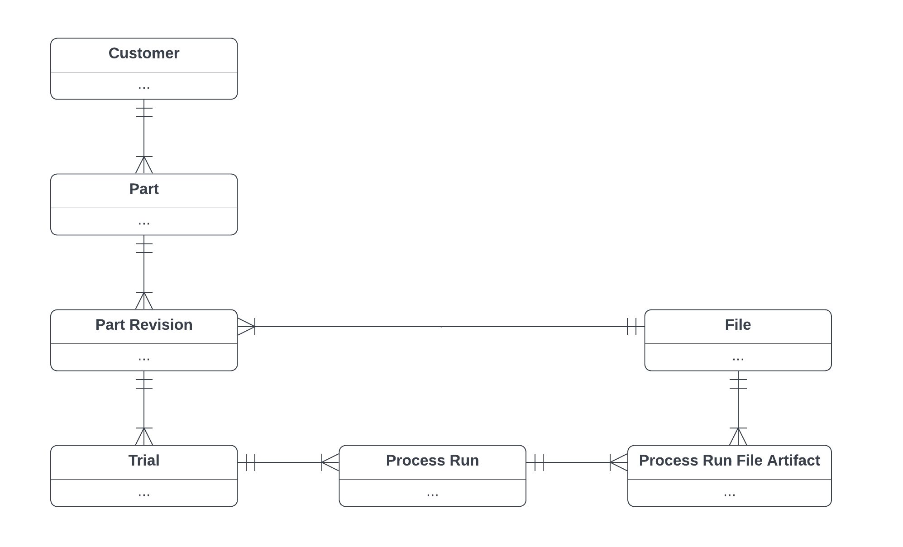

# Machina Labs Full Stack Homework
[Fork the repo](https://github.com/Machina-Labs/full_stack_homework/fork) to get started. When you're ready to submit, email us a link to your repository.
### Problem Statement

At Machina, we're building software to accelerate robotic manufacturing workflows. Our customers come to us with CAD files for their parts and we do research and development (R&D) to make them manufacturable with our robotic cells ([video demo](https://www.youtube.com/watch?v=uUsloEJkYdw)).

To get to a production-quality part, we have to perform possibly many trials until we succeed in getting getting under some allowable error tolerances. Additionally, this may involve revisions of the customer's original CAD file to make the geometry manufacturable. For the purposes of this homework, a successful trial looks like:
- Prepare some csv files for forming the part
- Form the part with our robotic cells
- Scan the part with our robotic cells
- Analyze the scan data to confirm success or failure

If the trial fails at any point (high tolerance error, metal sheet tears, etc.), we start a new trial by picking up at some earlier step where we think we can make changes to avoid that failure.

### Users and Data Model
Our users are our Machina teammates who are doing the R&D for customers. We store records of the information described above to help make their day-to-day work quicker and easier. Here's an overview of the data model we've supplied in `init.sql` to reflect this: 



### Implementation Specifications
- Implement a frontend client that supports the following use cases
    - A user can navigate a file tree that organizes files by customer, part, revision, and trial with the UI showing names, not identifiers
    - A user can select any non-3D file to see a preview of its contents
    - A user can download any of the files
- Implement a backend API that enables the client to interact with our domain and the files contained in `files.zip`.
- Use Docker (if Docker is not on your resume, feel free to ask us for additional documentation)

### Additional Requirements
- Frontend should focus on UX, a low-polish UI is okay
- Update [Getting Started](#getting-started) below with instructions on how to use your application
- Share a screen recorded demo (loom, quicktime, etc.) walking us through how to use your application

# Getting Started
### Installation
- [Install](https://docs.docker.com/desktop/) and run Docker

### Running the Application
You can start the application as follows. The first time it runs, it will run `init.sql` to create tables and populate them with some seed data.  
```
docker compose up
```

